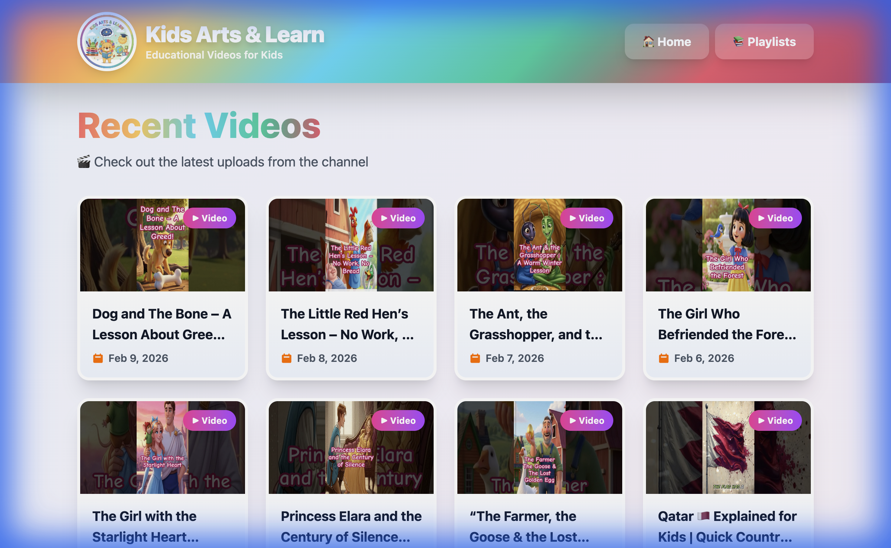
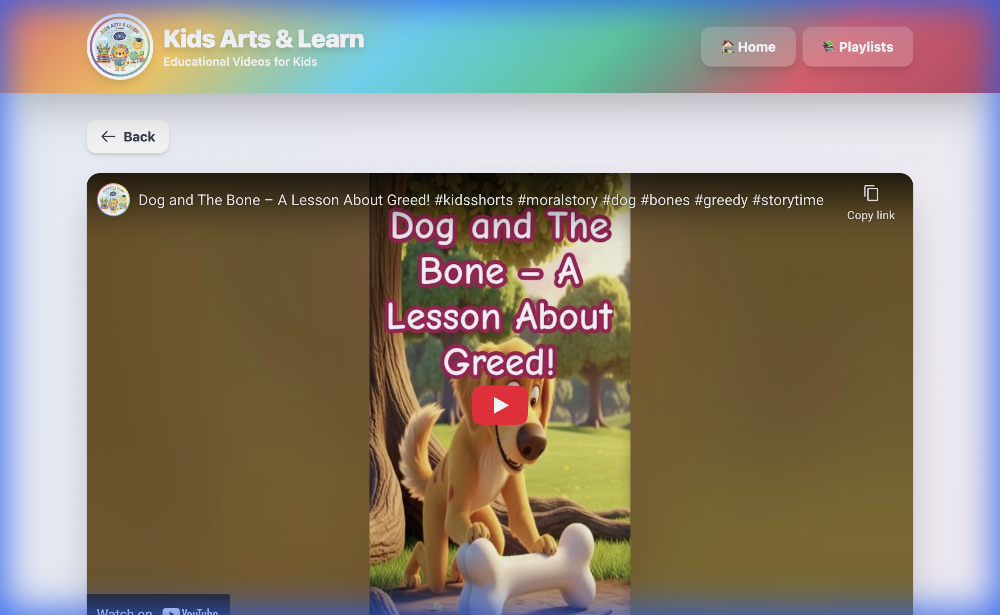
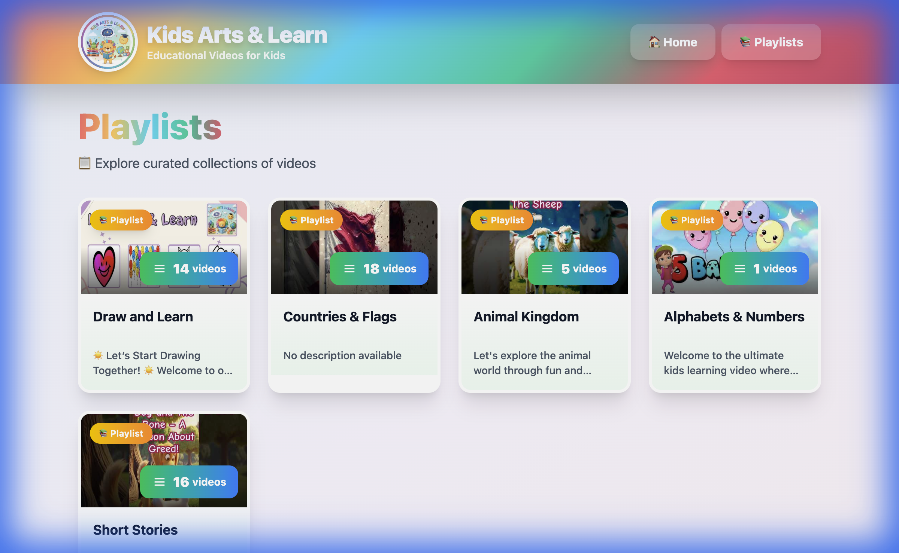

# YouTube Channel Viewer

A modern, responsive web application for browsing and watching videos from the **[KidsArtsLearn](https://www.youtube.com/@KidsArtsLearn)** YouTube channel. Built with React, TypeScript, and Vite, deployed on Google Firebase Hosting.

**🔴 [Live Demo](https://viewer-de70c.web.app/)** | **👍 [Subscribe to KidsArtsLearn](https://www.youtube.com/@KidsArtsLearn?sub_confirmation=1)**

## Features

- 📺 Browse recent videos from a YouTube channel
- 📋 View and explore channel playlists
- ▶️ Watch videos with embedded YouTube player
- 📱 Fully responsive design (mobile, tablet, desktop)
- 🚀 Progressive Web App (PWA) support
- ⚡ Fast loading with optimized caching
- 🔒 Secure HTTPS deployment
- 🎨 Modern UI with Tailwind CSS

## Screenshots

| Home Page | Video Player |
|-----------|--------------|
|  |  |

| Playlists Page |
|----------------|
|  |

## Tech Stack

- **Frontend**: React 19, TypeScript, Vite
- **Styling**: Tailwind CSS
- **Routing**: React Router v7
- **Data Fetching**: TanStack Query (React Query), Axios
- **API**: YouTube Data API v3
- **Deployment**: Firebase Hosting
- **PWA**: Vite PWA Plugin

## Prerequisites

- Node.js 18+ and npm
- YouTube Data API key ([Get one here](https://console.cloud.google.com/apis/credentials))
- Google Account (for Firebase deployment)

## Getting Started

### 1. Clone and Install

```bash
git clone git@github.com:arjunr1432/youtube-channel-viewer.git
cd youtube-channel-viewer
npm install
```

### 2. Configure Environment Variables

Copy the example environment file and add your YouTube API credentials:

```bash
cp .env.example .env
```

Edit `.env` and add your credentials:

```env
VITE_YOUTUBE_API_KEY=your_youtube_api_key_here
VITE_YOUTUBE_CHANNEL_ID=your_channel_id_here
VITE_APP_TITLE=Your Channel Name
```

### 3. Run Development Server

```bash
npm run dev
```

Visit `http://localhost:5173` to see the application.

### 4. Build for Production

```bash
npm run build
```

The optimized production build will be in the `dist/` directory.

## Deployment

This application is configured for deployment on Google Cloud Platform using Firebase Hosting (Free Tier).

### Setup & Deploy

1.  **Install Firebase CLI**:
    ```bash
    npm install -g firebase-tools
    ```

2.  **Login & Initialize**:
    ```bash
    firebase login
    firebase use --add
    ```
    (Select your project and alias it as `default`)

3.  **Deploy**:
    ```bash
    npm run deploy
    ```
    This script runs the build process (embedding environment variables) and deploys to Firebase.

## Project Structure

```
youtube-channel-viewer/
├── src/
│   ├── components/      # Reusable UI components
│   ├── pages/          # Page components
│   ├── services/       # API services
│   ├── types/          # TypeScript definitions
│   ├── utils/          # Utility functions
│   ├── App.tsx         # Main app component
│   └── main.tsx        # Entry point
├── public/             # Static assets
├── scripts/            # Build & Deploy scripts
│   └── deploy.sh
├── dist/               # Production build output
├── firebase.json       # Firebase Hosting config
├── .firebaserc         # Firebase project aliases
└── README.md
```

## Available Scripts

- `npm run dev` - Start development server
- `npm run build` - Build for production
- `npm run preview` - Preview production build locally
- `npm run lint` - Run ESLint
- `npm run deploy` - Build and deploy to Firebase Hosting

## Configuration

### YouTube API Setup

1. Go to [Google Cloud Console](https://console.cloud.google.com/)
2. Create a new project or select existing one
3. Enable YouTube Data API v3
4. Create credentials (API Key)
5. Restrict the API key:
   - Application restrictions: HTTP referrers (your domain)
   - API restrictions: YouTube Data API v3

### Environment Variables

| Variable | Description | Required |
|----------|-------------|----------|
| `VITE_YOUTUBE_API_KEY` | YouTube Data API key | Yes |
| `VITE_YOUTUBE_CHANNEL_ID` | YouTube channel ID to display | Yes |
| `VITE_APP_TITLE` | Application title | No |

## Features in Detail

### Caching Strategy

- API responses cached for 5 minutes (videos) and 10 minutes (playlists)
- Stale-while-revalidate for better UX
- CDN caching for static assets

### Security

- HTTPS-only access
- Content Security Policy (CSP)
- HSTS headers
- XSS protection
- API key restrictions

### Performance

- Code splitting for optimal loading
- Lazy loading for images
- Optimized bundle size
- Gzip/Brotli compression
- CDN distribution

## Browser Support

- Chrome (latest)
- Firefox (latest)
- Safari (latest)
- Edge (latest)
- Mobile browsers (iOS Safari, Chrome Android)

## License

MIT

## Contributing

Contributions are welcome! Please open an issue or submit a pull request.
